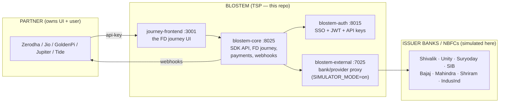
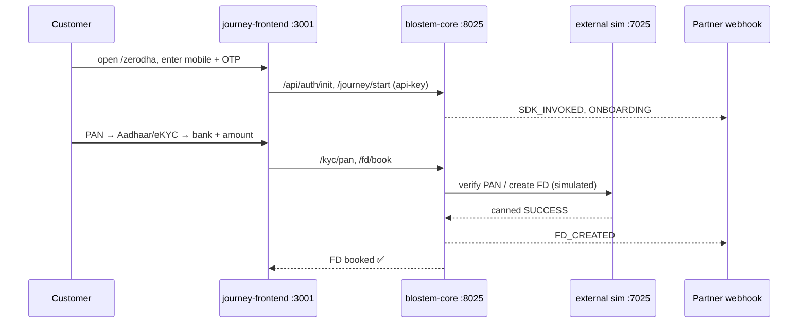
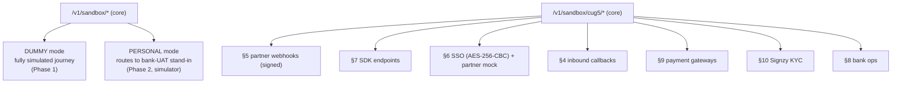

# Blostem FD Sandbox — Project Overview

> **Read this first.** It explains what this project is, how it's put together, and how to run it —
> assuming you know nothing about it. Diagrams use [Mermaid](https://mermaid.js.org/) (renders on
> GitHub and in VS Code). Deep references: [`arch.md`](arch.md) (cug-5 contract), [`plan.md`](plan.md)
> (delivery plan), [`check.md`](check.md) (test checklist), [`PRODUCTION_READINESS.md`](PRODUCTION_READINESS.md).

---

## 1. What is this?

Blostem lets fintech **partners** (Zerodha, Jio, GoldenPi, …) offer **Fixed Deposits (FDs)** from
**banks/NBFCs** (Shivalik, Unity, Suryoday, Bajaj Finance, …) inside the partner's own app.

Blostem is a **TSP (Technical Service Provider)** — it provides the integration plumbing. It does
**not** hold the money (the bank does) and does **not** own the user (the partner does).

This repo is a **local sandbox** that runs the **same code** as the production deployment
(`cug-5.blostem.com`) but with every external system **simulated**, so you can build and test the
full FD journey safely — no real banks, no real money, no real KYC.

```
A customer opens the partner's app  →  goes through a guided FD journey
(phone → KYC → pick a bank & amount → pay → FD booked)  →  the bank issues the FD
→  Blostem fires webhooks back to the partner at each step.
```

---

## 2. The three parties



---

## 3. Components & where they run

| Component | Folder | Local port | What it does |
|---|---|---:|---|
| **journey-frontend** | `journey-frontend/` | 3001 | Next.js FD journey UI (the screens the customer sees) |
| **blostem-auth** | `Backend/blostem-auth/` | 8015 | Partner SSO, JWTs, SDK API-key validation |
| **blostem-core** | `Backend/blostem-core/` | 8025 | The brain: SDK API, FD journey, payments, outbound webhooks, **sandbox + cug-5 layers** |
| **blostem-external** | `Backend/blostem-external/` | 7025 | Bank/NBFC integration proxy; `SIMULATOR_MODE=on` returns canned bank responses |
| **Postgres** | localhost:5432 | — | DBs `auth_restored`, `core_restored`, `external_restored` |

Sandbox switch: `BLOSTEM_ENV=sandbox` + `SANDBOX_MODE=true` in each service's `.env`. A **boot guard**
refuses to start if any DB/provider URL looks like production.

---

## 4. The FD journey (happy path)



The frontend talks **only** to the backend (it sets `SANDBOX_BACKEND_CORE_URL`), so the backend is the
single source of truth — the frontend never writes the DB directly.

---

## 5. Two journey modes + the cug-5 replica



- **Phase 1 — DUMMY** (`/v1/sandbox/*`): a fully simulated FD journey for 10 seeded dummy users per
  partner. Proves API keys, journeys, webhooks, partner isolation, delete/reset. **Operational.**
- **Phase 2 — PERSONAL** (`/v1/sandbox/*`, `x-sandbox-mode: personal`): journeys that route to a
  "bank UAT" — here the external **simulator** stands in. Lifecycle: payment, VKYC, refund, maturity,
  reinvest, premature-withdraw. **Operational against the simulator** (real bank UAT needs credentials).
- **cug-5 replica** (`/v1/sandbox/cug5/*`): a wire-compatible mock of the production cug-5 surface in
  [`arch.md`](arch.md) — SDK endpoints (§7), signed partner webhooks (§5), SSO (§6), inbound callbacks
  (§4), payment gateways (§9), Signzy KYC (§10), bank ops (§8). **§4–§10 fully replicated.**

---

## 6. Endpoint map (cheat sheet)

All under `blostem-core :8025`. Most take an `api-key` header (a partner's sandbox key).

| Area | Endpoint |
|---|---|
| Health / status | `GET /` , `GET /v1/sandbox/status` |
| Dummy journey | `POST /v1/sandbox/{auth/init, users/register, journeys/start, fd/book}` , `DELETE /v1/sandbox/journeys/:jid` |
| Personal lifecycle | `POST /v1/sandbox/personal/event/:eventType` |
| Webhook catcher | `POST /v1/sandbox/webhook-catcher/:partnerCode` |
| cug-5 SDK (§7) | `GET/POST /v1/sandbox/cug5/sdk/...` |
| cug-5 webhooks (§5) | `POST /v1/sandbox/cug5/webhooks/{emit, catch/:partnerCode}` |
| cug-5 SSO (§6) | `POST /v1/sandbox/cug5/sso` , `GET /v1/sandbox/cug5/partner/get-customer-details` |
| cug-5 callbacks (§4) | `POST /v1/sandbox/cug5/callbacks/:provider` |
| cug-5 payment (§9) | `POST /v1/sandbox/cug5/payment/:gateway/{order, upi-intent, status}` |
| cug-5 KYC (§10) | `POST /v1/sandbox/cug5/kyc/signzy/:operation` |
| cug-5 bank (§8) | `POST /v1/sandbox/cug5/bank/:issuer/:operation` |

5 demo partner API keys (32 chars): `zrdh… (ZERODHA)`, `jiof… (JIO)`, `gldp… (GOLDENPI)`, `jptr… (JUPITER)`, `tide… (TIDE)`.

---

## 7. Repo map

```
sandbox/
├─ journey-frontend/                 Next.js UI (:3001)
├─ Backend/
│  ├─ blostem-auth/                  auth service (:8015)
│  ├─ blostem-core/                  core service (:8025)
│  │  └─ src/
│  │     ├─ services/sandbox.service.js        Phase 1/2 logic
│  │     ├─ services/cug5.service.js           cug-5 §5/§6/§7
│  │     ├─ services/cug5-external.service.js  cug-5 §8/§9/§10
│  │     ├─ routes/v1/sandbox.route.js + sandbox-cug5.route.js
│  │     ├─ utils/sandbox.js                   env guards, helpers
│  │     └─ scripts/seed-sandbox.js            idempotent seeder
│  │  └─ tests/contracts/                      contract fixtures + tests
│  └─ blostem-external/              bank proxy + simulator (:7025)
├─ arch.md                cug-5 production contract (payloads/headers/responses)
├─ plan.md                two-phase delivery plan
├─ check.md               manual/HTTP test checklist (§1–§28)
├─ status.md              current status
├─ todo.md                actionable checklist
├─ requirements.md        env / credentials / infra needed
├─ PRODUCTION_READINESS.md  what's left for production
└─ OVERVIEW.md            (this file)
```

---

## 8. Run it locally

```powershell
# 1. Postgres must have auth_restored / core_restored / external_restored
# 2. Seed partners, keys, configs, 10 dummy users/partner (idempotent):
node Backend/blostem-core/scripts/seed-sandbox.js

# 3. Start each service (separate terminals), from its folder:
cd Backend/blostem-auth     ; node src/index.js     # :8015
cd Backend/blostem-core     ; node src/index.js     # :8025
cd Backend/blostem-external ; node src/index.js     # :7025
cd journey-frontend         ; npm run dev           # :3001

# 4. Open the UI:  http://localhost:3001/zerodha
```

### Test it

```powershell
# backend contract tests (sandbox + cug-5)
cd Backend/blostem-core ; npx jest tests/contracts        # 76 tests
# frontend tests
cd journey-frontend ; npx vitest run                      # 37 tests
# manual/HTTP walkthroughs:  see check.md §1–§28
```

---

## 9. Glossary

| Term | Meaning |
|---|---|
| **FD** | Fixed Deposit |
| **TSP** | Technical Service Provider (Blostem's role — plumbing, not money/user) |
| **Partner** | The fintech whose app the customer uses (Zerodha, Jio, …) |
| **Issuer** | The bank/NBFC that holds the FD (Shivalik, Unity, Bajaj, …) |
| **CUG / cug-5** | "Customer User Group" — a production deployment; `cug-5` is the one this sandbox mirrors |
| **DUMMY / PERSONAL** | sandbox journey modes — fully simulated vs routed to a bank-UAT stand-in |
| **jid** | journey id — the partner's correlation key across a journey's webhooks |
| **VKYC / eKYC** | video / electronic Know-Your-Customer |
| **Simulator** | `SIMULATOR_MODE=on` in blostem-external — returns canned bank responses |
